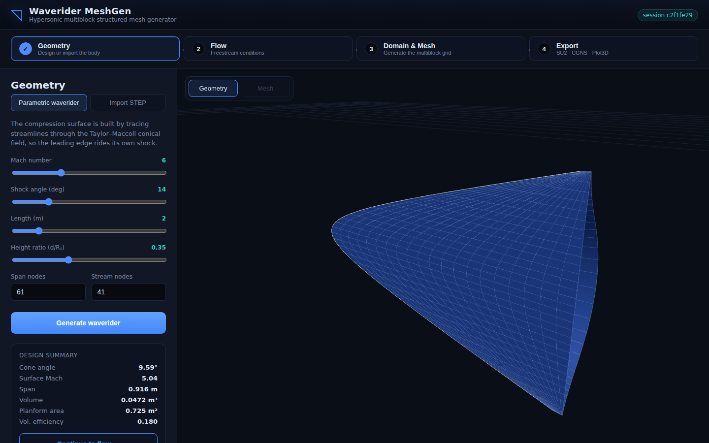

# Waverider MeshGen

An automatic **multiblock structured mesh generator** for hypersonic
waveriders. Design a waverider from just a Mach number and a shock angle (or
import a STEP body), size the mesh from the flow conditions, and export a
structured multiblock grid to **SU2** and **CGNS** — through a left-to-right web
workflow.



> Geometry → Flow → Domain & Mesh → Export, with a live 3-D viewport.

---

## What it does

| Stage | Capability |
|-------|-----------|
| **Geometry** | Cone-derived (osculating-cone) waverider generated by tracing streamlines through the **Taylor–Maccoll** conical flow field, so the leading edge rides its own shock. Or **import a clean STEP solid** (OpenCASCADE) and re-grid it. |
| **Flow** | US Standard Atmosphere 1976 + Sutherland viscosity → Reynolds number and the **y⁺-driven first-cell height** that makes the mesh flow-aware. |
| **Domain & Mesh** | Body-fitted **O-grid** wrapping each constant-x lens cross-section. **Wall-normal (orthogonal) extrusion** blended to a circular farfield with hyperbolic-tangent wall clustering; an adaptive weight guarantees positive cells on slender bodies. Optional **elliptic (Winslow) smoothing**. Split into connected structured blocks. |
| **Export** | Native **SU2** (tagged boundary markers), structured multiblock **CGNS/HDF5** (SIDS, `ZoneBC`), and **Plot3D**. |

### Validated physics

The aerodynamic core is checked against textbook/reference data (see
`backend/tests/`):

- Oblique shock θ–β–M: M=2, θ=20° → β_weak=53.42°, β_strong=74.27°, θ_max=22.97° (Anderson).
- Taylor–Maccoll cone: M=2, shock=37.8° → cone=20.0°, surface Mach=1.568 (NACA 1135).
- US Std Atmosphere and y⁺ first-cell sizing.

---

## Architecture

```
backend/                      Python compute + web API
  meshgen/
    flow/        oblique_shock, taylor_maccoll, conditions
    geometry/    waverider, surface, step_io (OCP), regrid
    domain/      farfield sizing
    mesh/        clustering, block, multiblock, topology
    io/          assembler, su2_writer, cgns_writer, plot3d_writer
    api/         FastAPI server, schemas, viz payloads
    pipeline.py  end-to-end orchestration
    cli.py       command-line interface
  tests/         pytest regression suite
frontend/                     React + Three.js + Vite web UI
  src/panels/    Geometry / Flow / Mesh / Export steps
  src/Viewport.jsx  Three.js 3-D viewport
```

The same `pipeline` powers the CLI and the API; the front-end is a thin client
over the API.

---

## Quick start

### 1. Backend

```bash
cd backend
python -m pip install -r requirements.txt
python -m uvicorn meshgen.api.server:app --port 8000
```

### 2. Frontend

```bash
cd frontend
npm install
npm run build          # produces dist/, served by the backend at http://localhost:8000
# or, for live development with hot reload:
npm run dev            # http://localhost:5173 (proxies /api to :8000)
```

Open **http://localhost:8000** and step through Geometry → Flow → Mesh → Export.

### Command line (no UI)

```bash
cd backend
# Parametric waverider -> SU2 + CGNS
python -m meshgen.cli --mach 7 --shock-angle 13 --length 2.5 \
    --altitude 32000 --stream-blocks 3 --wrap-blocks 2 \
    --out mesh --formats su2,cgns,plot3d

# Import a STEP body and mesh it
python -m meshgen.cli --step body.step --out mesh --formats su2,plot3d
```

### Tests

```bash
cd backend && python -m pytest -q      # 12 tests
```

---

## Boundary conditions

The mesher tags each block face, carried into both exporters:

| Face | SU2 marker | CGNS `BCType` |
|------|-----------|---------------|
| body wall | `wall` | `BCWallViscous` |
| outer boundary | `farfield` | `BCFarfield` |
| nose plane | `inflow` | `BCInflowSupersonic` |
| base plane | `outflow` | `BCOutflowSupersonic` |
| block interfaces | (merged, watertight) | — |

---

## Current scope & roadmap

This is a working v1. Honest limitations:

- **Mesh quality**: a full 3-D hexahedral volume mesh with guaranteed positive
  cells and good bulk orthogonality (mean ≈ 73–80° across M=4–14). Skew is
  localised to the two sharp lens tips (a waverider's sharp leading edges) and
  the polar nose — inherent to a single O-grid around a pointed, sharp-edged
  body. Resolving these fully needs a C-grid or dedicated edge/nose blocks.
- **Wake**: the domain currently ends at the base plane (supersonic outflow); a
  dedicated downstream wake block is planned.
- **Symmetry**: a half-model symmetry option would halve cell count.
- **STEP re-gridding** assumes a slender, z-single-valued body (the waverider
  class). Arbitrary solids are out of scope for structured multiblock.
- **CGNS** writes `GridConnectivity1to1` next for full multiblock interfaces.

---

## Dependencies

Python: numpy, scipy, meshio, h5py, **cadquery-ocp** (OpenCASCADE STEP),
fastapi, uvicorn, pydantic. Frontend: react, three, vite.
